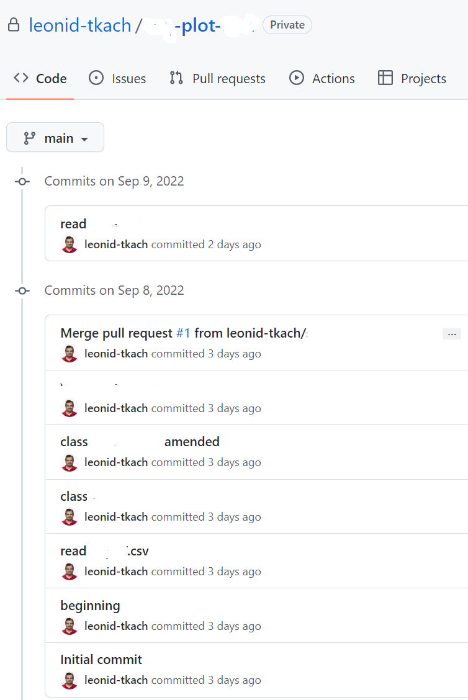

# plots

Here is the RShiny app produced by this code: https://leonid-tkach.shinyapps.io/plots/

There are two plots in it as in the screenshot below. One should try clicking *New Blobset* button and mean points in the lower plot.

## Topic

### Selected topic

I am really sorry, but I am not ready to inform anybody about the topic for my project yet. I am going to disclose it on the day of my final presentation. Some of my repositories are private now, I'll make them public that day.

By the way, I am going to use some R Shiny instruments similar to the demo. One of the plots will show data, the user will be able to filter it clicking on some of its characteristics on other plots.

I understand that it's very inconvenient for the graders. Nearly everything is going to be provided in the end.

I am sorry again.

### Reason why I selected this topic

This project was my Master’s thesis in 2013. Due to some circumstances, I couldn't proceed. Now I am going to have another try.

## Data

### Description of their source of data

Will be disclosed later.

### Questions I hope to answer with the data

Will be disclosed later.

## GitHub

### Communication protocols

I am doing my project by myself, so there are no any protocols.

### At least one branch for each team member
### Each team member has at least four commits from the duration of the first segment

There are some branches and commits in this repository, and here is a screenshot from one of my private repositories for this project:

## Machine Learning Model

As the data is a set of time series, I suppose the model will be something about recurrent neural networks (RNN). I am not sure. Anyway, data preprocessing is going to take huge amount of time. 

### Takes in data in from the provisional database

Not ready yet.

### Outputs label(s) for input data

Not ready yet.

## Database

I am going to use PostgreSQL.

I want to deploy a final RShiny part of my project on Heroku, not on shinyapps.io as the demo. I am going to use as my inspiration this: https://github.com/blakiseskream/shiny-heroku

I am writing preprocessing parts in Jupyter Python, going to move to Google Colab later.

ML parts are going to be deployed in Google Colab.

### Sample data that mimics the expected final database structure or schema

Not ready yet.

### Draft machine learning module is connected to the provisional database

Not ready yet.
