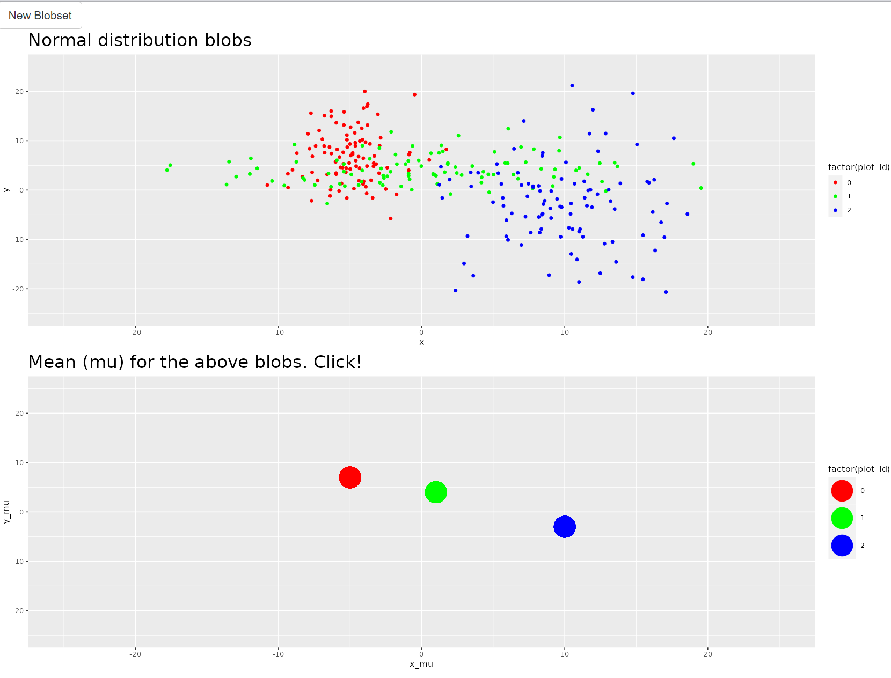

# plots

It's a demo of clickable ggplot2 plots.

Here is the RShiny app produced by this code: https://leonid-tkach.shinyapps.io/plots/

There are two plots in it as in the screenshot below. One should try clicking *New Blobset* button and mean points in the lower plot.

